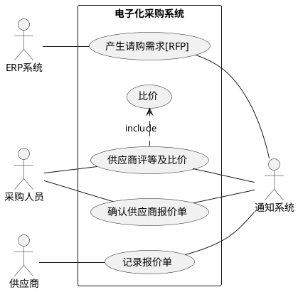

## dockcer安装

## 远程配置

## 如何画用例图
分析用户与系统的交互方式

### 参与者Actor
建立系统的外部用户模型，对系统边界之外的对象进行描述

### 用例Usecase
用例是从系统的使用者角度来描述系统中的信息很多种描述方法
```
用例名称: xxx
用例标识：XXX
简要说明：do something
前置条件：xxx
基本事件流: first xx then xx
其它事件流:
异常事件流: do xx if xx
后置条件: do xx after
```
### 用例之间的关系
包含： 做A事件需要做B和C <<include>>
扩展: 某些场景下才会做的行为<<extend>> 
泛化：同属一件事，但是实现方法不同
分组：xxx

### 实例
[参看这里](https://love.junzimu.com/archives/1422), 我不常用就不细搞了。




