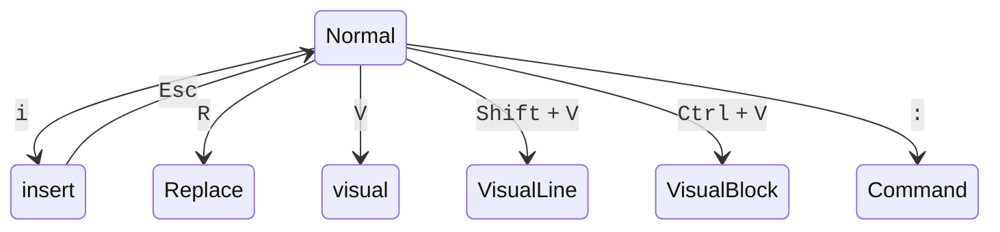

# vim使用简介

## 01 模式转换

```mermaid
stateDiagram-v2
Normal --> insert : <kbd>i</kbd>
insert --> Normal : <kbd>Esc</kbd>
Normal --> Replace: <kbd>R</kbd>
Normal --> visual : <kbd>V</kbd>
Normal --> VisualLine : <kbd>Shift</kbd> + <kbd>V</kbd>
Normal --> VisualBlock : <kbd>Ctrl</kbd> + <kbd>V</kbd>
Normal --> Command : <kbd>#colon;</kbd>
```
